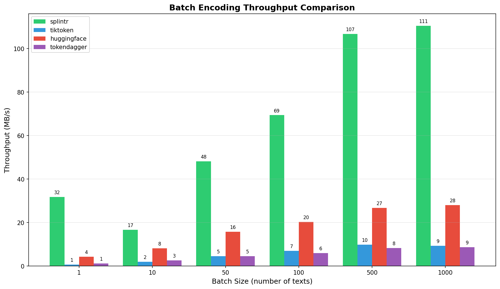
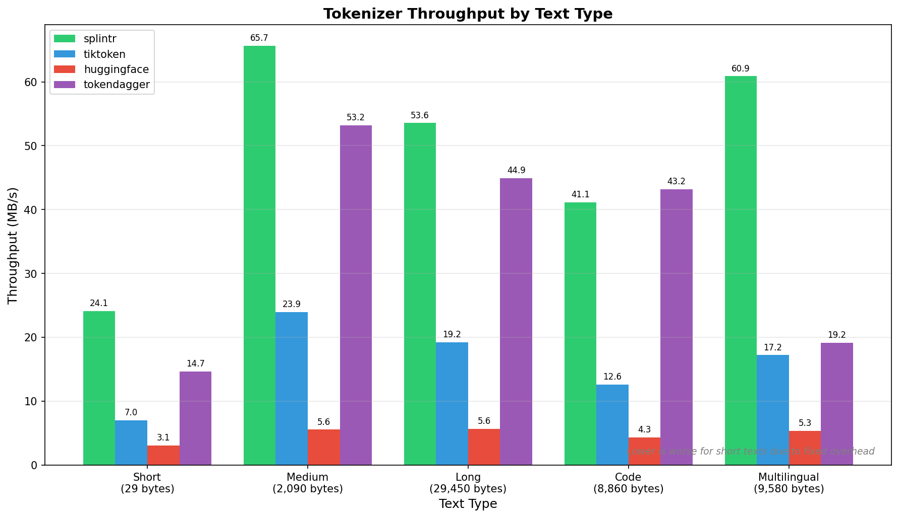
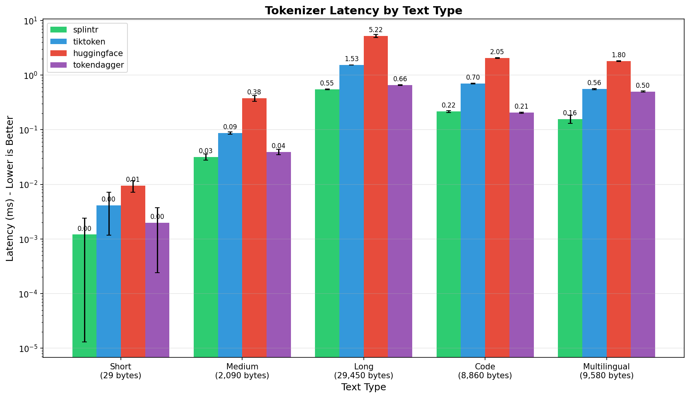
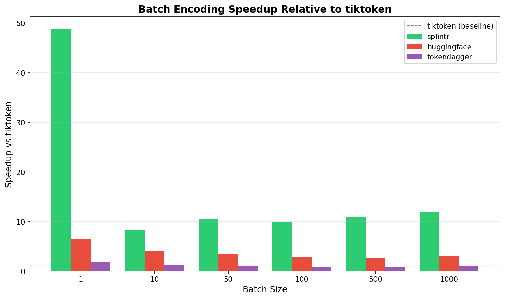
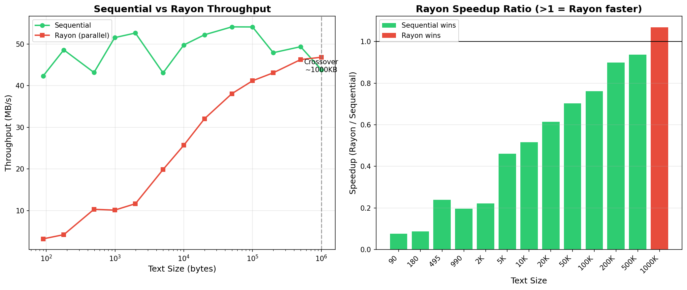

[](https://crates.io/crates/splintr) [](https://pypi.org/project/splintr-rs/) [](https://opensource.org/licenses/MIT)

**A high-performance BPE tokenizer built with Rust with Python bindings, focused on speed, safety, and resource optimization.**

## The Problem

Tokenization is everywhere in modern AI. Whether you're building LLM applications, training models, or processing data pipelines, you're tokenizing text constantly. But existing tokenizers have a problem: they're slow.

When you need to tokenize batches of prompts, documents, or training data, you're stuck waiting. Python-based tokenizers can't fully leverage modern multi-core CPUs. You need something faster.

## The Solution

Splintr brings Rust performance to Python. Built from the ground up for speed and efficiency:



| Configuration | Splintr      | Tiktoken | HuggingFace | TokenDagger |
| ------------- | ------------ | -------- | ----------- | ----------- |
| 1,000 texts   | **111 MB/s** | 9 MB/s   | 28 MB/s     | 9 MB/s      |
| 500 texts     | **107 MB/s** | 10 MB/s  | 27 MB/s     | 8 MB/s      |
| 100 texts     | **69 MB/s**  | 7 MB/s   | 20 MB/s     | 6 MB/s      |

**10-12x faster than tiktoken. 4x faster than HuggingFace. Built in Rust, accessible from Python.**

## Quick Start

### Python

```bash
pip install splintr-rs
```

```python
from splintr import Tokenizer

# Load a pretrained vocabulary
tokenizer = Tokenizer.from_pretrained("cl100k_base")  # OpenAI GPT-4/3.5
# tokenizer = Tokenizer.from_pretrained("llama3")      # Meta Llama 3 family
# tokenizer = Tokenizer.from_pretrained("deepseek_v3") # DeepSeek V3/R1

# Encode and decode
tokens = tokenizer.encode("Hello, world!")
text = tokenizer.decode(tokens)

# Batch encode (10-12x faster)
texts = ["Hello, world!", "How are you?", "Machine learning is fun!"]
batch_tokens = tokenizer.encode_batch(texts)
```

See the [API Guide](docs/api_guide.md) for complete documentation and examples.

### Rust

```toml
[dependencies]
splintr = "0.6.0"
```

```rust
use splintr::{Tokenizer, CL100K_BASE_PATTERN};

let tokenizer = Tokenizer::new(encoder, special_tokens, CL100K_BASE_PATTERN)?;
let tokens = tokenizer.encode("Hello, world!");
let batch_tokens = tokenizer.encode_batch(&texts);
```

See the [API Guide](docs/api_guide.md) and [docs.rs](https://docs.rs/splintr) for complete Rust documentation.

## Key Features

**Performance where it matters:**

- **12x faster batch encoding** - Parallel processing across multiple texts using Rayon
- **3-4x faster single text encoding** - Optimized sequential algorithm for typical use cases
- **Smart parallelization** - Sequential for small texts (<1MB), parallel for large datasets
- **LRU caching** - Avoid redundant encoding of frequently seen text chunks

**Built for production:**

- **Compatible vocabularies** - Supports cl100k_base, o200k_base (OpenAI), Llama 3 family (Meta), and DeepSeek V3 (DeepSeek)
- **Streaming decoders** - Real-time LLM output display with proper UTF-8 handling ([guide](docs/api_guide.md#streaming-decoder))
- **54 agent tokens** - Built-in support for chat, CoT reasoning, ReAct agents, tool calling, RAG citations ([docs](docs/special_tokens.md))
- **Battle-tested algorithms** - Regexr with JIT (pure Rust), Aho-Corasick for special tokens, linked-list BPE

**Cross-platform:**

- Python bindings via PyO3 (Linux, macOS, Windows)
- Native Rust library for maximum performance

## Performance Deep Dive

All benchmarks performed on Linux (6.16.8-arch3-1) with 24 CPU cores, comparing against tiktoken (reference Python implementation), Hugging Face tokenizers, and TokenDagger.

### Single Text Encoding

For single texts, splintr achieves **3-4x faster** encoding across various text sizes:



**Latency by content type:**



Consistent low latency across Python code, JSON, English prose, and Chinese text makes splintr ideal for interactive applications and real-time processing.

### Batch Encoding

The real magic happens with batches. Splintr parallelizes across texts to achieve **10-12x speedup**:



Higher speedups on larger batches where parallelization overhead is amortized. Perfect for:

- Training data preprocessing
- Bulk document tokenization
- API batch processing
- Data pipeline throughput

### Design Decision: Sequential by Default

Splintr uses **sequential encoding for single texts** and **parallel encoding across batches** based on empirical benchmarking:



**Key findings:**

- Sequential is faster for texts up to ~1MB (typical LLM prompts and documents)
- Rayon's parallelization overhead only pays off at ~1MB+ text sizes
- Most real-world inputs are well under 1MB
- `encode()` uses sequential processing for optimal single-text performance
- `encode_batch()` parallelizes across multiple texts for maximum throughput
- `encode_rayon()` available for the rare cases where you have >1MB single texts

This architecture ensures splintr is optimized for the most common tokenization patterns in LLM applications.

### Running Benchmarks Yourself

```bash
# Clone and install
git clone https://github.com/farhan-syah/splintr.git
cd splintr
pip install -e .
pip install tiktoken

# Run the benchmark suite
cd benchmarks
python benchmark.py --model cl100k_base --output results/my_benchmark.json

# View results
cat results/my_benchmark.md
```

The benchmark suite tests single text encoding, batch encoding, streaming decoder performance, and special token handling across various content types.

### Regex Backends

Splintr uses a pure-Rust regex engine ([`regexr`](https://crates.io/crates/regexr)) by default, with optional PCRE2 support for compatibility.

**Default Backend (regexr):**
- Pure Rust implementation (no C dependencies)
- JIT compilation and SIMD acceleration
- Native UTF-8 and Unicode property support

**Optional PCRE2 Backend:**

```python
from splintr import Tokenizer

# Default: regexr backend (pure Rust)
tokenizer = Tokenizer.from_pretrained("cl100k_base")

# Optional: switch to PCRE2 (requires --features pcre2)
tokenizer = Tokenizer.from_pretrained("cl100k_base").pcre2(True)
```

To enable PCRE2, build with the feature flag:

```bash
maturin develop --release --features pcre2
```

**Benchmarking:**

```bash
# Compare backends (requires PCRE2 feature)
python benchmarks/benchmark_regexr_comparison.py --model cl100k_base

# Visual comparison with charts
python benchmarks/benchmark_regexr_viz.py --model cl100k_base
```

## Streaming Decoders

For real-time LLM applications where tokens arrive one at a time, Splintr provides streaming decoders that handle UTF-8 boundary alignment:

```python
# Regular streaming decoder (cl100k_base, o200k_base, llama3)
decoder = tokenizer.streaming_decoder()

# ByteLevel streaming decoder (deepseek_v3, GPT-2)
decoder = tokenizer.byte_level_streaming_decoder()

# Process tokens as they arrive
for token_id in token_stream:
    if text := decoder.add_token(token_id):
        print(text, end="", flush=True)
print(decoder.flush())
```

**Why streaming decoders?** BPE tokens don't align with UTF-8 character boundaries. A multi-byte character like "世" might split across tokens. The streaming decoder buffers incomplete sequences and only outputs complete characters.

See the [API Guide](docs/api_guide.md#streaming-decoder) for detailed usage, examples, and best practices.

## Supported Vocabularies

| Vocabulary     | Used By                       | Vocabulary Size | Special Tokens | Import Constant       |
| -------------- | ----------------------------- | --------------- | -------------- | --------------------- |
| `cl100k_base`  | GPT-4, GPT-3.5-turbo          | ~100,000        | 5 + 54 agent   | `CL100K_BASE_PATTERN` |
| `o200k_base`   | GPT-4o                        | ~200,000        | 2 + 54 agent   | `O200K_BASE_PATTERN`  |
| `llama3`       | Llama 3, 3.1, 3.2, 3.3 (Meta) | ~128,000        | 11 + 54 agent  | `LLAMA3_PATTERN`      |
| `deepseek_v3`  | DeepSeek V3, DeepSeek R1      | ~128,000        | 17 + 54 agent  | `LLAMA3_PATTERN`      |

**OpenAI standard tokens:**

- **cl100k_base**: `<|endoftext|>`, `<|fim_prefix|>`, `<|fim_middle|>`, `<|fim_suffix|>`, `<|endofprompt|>`
- **o200k_base**: `<|endoftext|>`, `<|endofprompt|>`

**Meta Llama 3 standard tokens:**

- **llama3**: `<|begin_of_text|>`, `<|end_of_text|>`, `<|start_header_id|>`, `<|end_header_id|>`, `<|eot_id|>`, `<|eom_id|>` (3.1+), `<|python_tag|>` (3.1+), `<|step_id|>` (3.2-Vision), `<|image|>` (3.2-Vision)

**DeepSeek V3 standard tokens:**

- **deepseek_v3**: `<｜begin▁of▁sentence｜>`, `<｜end▁of▁sentence｜>`, `<think>`, `</think>`, `<｜User｜>`, `<｜Assistant｜>`, `<|EOT|>`, FIM tokens (`<｜fim▁hole｜>`, `<｜fim▁begin｜>`, `<｜fim▁end｜>`), tool calling tokens (`<｜tool▁calls▁begin｜>`, `<｜tool▁call▁begin｜>`, etc.)

### Agent Tokens (54 per model)

Splintr extends all vocabularies with 54 specialized tokens for building agent systems:

```python
from splintr import Tokenizer, CL100K_AGENT_TOKENS

tokenizer = Tokenizer.from_pretrained("cl100k_base")
text = "<|think|>Let me reason...<|/think|>The answer is 42."
tokens = tokenizer.encode_with_special(text)
print(CL100K_AGENT_TOKENS.THINK)      # 100282
print(CL100K_AGENT_TOKENS.FUNCTION)   # 100292
```

| Category     | Example Tokens                                      | Purpose                    |
| ------------ | --------------------------------------------------- | -------------------------- |
| Conversation | `system`, `user`, `assistant`, `im_start`, `im_end` | ChatML format              |
| Thinking     | `think`                                             | Chain-of-Thought reasoning |
| ReAct        | `plan`, `step`, `act`, `observe`                    | Agent action loops         |
| Tools        | `function`, `result`, `error`                       | Function calling           |
| RAG          | `context`, `quote`, `cite`, `source`                | Citations                  |

See [docs/special_tokens.md](docs/special_tokens.md) for the complete list and [API Guide](docs/api_guide.md#agent-tokens-usage) for usage examples.

## How It Works

Splintr implements several optimizations that make tokenization faster:

- **Regexr with JIT compilation**: Pure Rust regex engine with SIMD acceleration
- **Rayon parallelism**: Leverages multiple CPU cores for batch encoding
- **Linked-list BPE algorithm**: Avoids O(N²) complexity on pathological inputs
- **FxHashMap**: Faster lookups than default SipHash for non-adversarial contexts
- **Aho-Corasick for special tokens**: Fast multi-pattern matching without regex alternation
- **LRU cache**: Avoids redundant BPE encoding of frequently seen chunks

## Use Cases

**LLM Applications:**

- Tokenizing prompts with 3-4x lower latency
- Streaming decoder for real-time output display
- Token counting for API cost estimation

**Agent Systems:**

- Building ReAct agents with structured reasoning tokens
- Tool-calling systems with function tokens
- Chain-of-Thought reasoning with thinking tokens

**Training Pipelines:**

- Fast batch encoding of large datasets (10-12x speedup)
- Preprocessing millions of documents efficiently
- Parallel tokenization across distributed systems

**RAG Applications:**

- Structured context injection with citation tokens
- Document chunking with section markers
- Source tracking through tokenization

**Data Processing:**

- Bulk document tokenization
- Multi-language text processing
- Real-time text preprocessing

## Contributing

Contributions are welcome! Here's how you can help:

1. **Report bugs**: Open an issue with a minimal reproduction case
2. **Suggest features**: Describe your use case and why the feature would be helpful
3. **Submit pull requests**:
   - Add tests for new functionality
   - Run `cargo test` and `cargo clippy` before submitting
   - Update documentation as needed

### Development Setup

```bash
# Clone the repository
git clone https://github.com/farhan-syah/splintr.git
cd splintr

# Install pre-commit hook (recommended)
cp hooks/pre-commit .git/hooks/pre-commit
chmod +x .git/hooks/pre-commit

# Build the Rust library
cargo build --release

# Build Python bindings
pip install maturin
maturin develop --release

# Run tests
cargo test                    # Rust tests
cargo clippy --all-targets    # Linting
cargo fmt --all --check       # Format check
```

The pre-commit hook automatically runs formatting, clippy, and tests before each commit.

## Acknowledgments

Splintr builds upon concepts from:

- [tiktoken](https://github.com/openai/tiktoken) - OpenAI's reference BPE tokenizer
- [tokenizers](https://github.com/huggingface/tokenizers) - Hugging Face's tokenization library

The performance optimizations are informed by profiling real-world usage patterns in LLM applications.

## Citation

If you use Splintr in your research, please cite:

```bibtex
@software{splintr,
  author = {Farhan Syah},
  title = {Splintr: High-Performance BPE Tokenizer},
  year = {2025},
  url = {https://github.com/farhan-syah/splintr}
}
```
